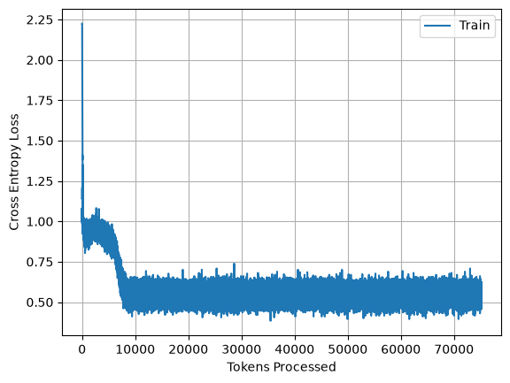
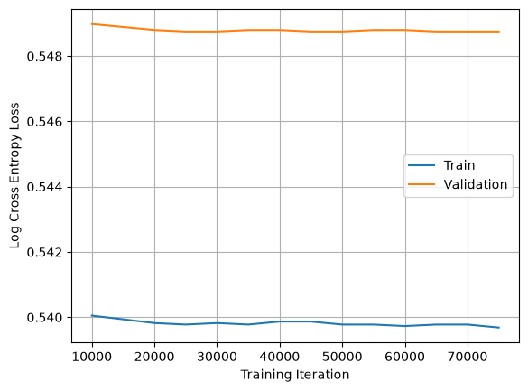

# TinyStories Language Model — Training Evaluation

## 2026-09-24 — Training Investigation

Today I compared the 10K and 75K checkpoints to understand why the model showed almost no improvement after 10K iterations.

### Findings

- The 10K and 75K checkpoints produced nearly identical generations on five fixed prompts.
- I initially suspected that the checkpoints were not being loaded correctly.
- I compared model parameters between the two checkpoints and confirmed that the weights were different, although the mean absolute differences were very small (~1e-5 to 1e-4).
- Validation loss also changed only slightly, from approximately 1.7315 at 10K to 1.7311 at 75K.
- I then inspected the learning-rate schedule and found the likely cause.

The LR schedule was originally configured for a 10K-iteration training run:

- `max_lr = 1e-2`
- `min_lr = 1e-5`
- `warmup_iters = 2K`
- `cosine_cycle_iters = 9K`

However, I later extended training to 75K iterations without updating the LR schedule.

As a result, the learning rate had already reached `1e-5` by approximately 10K iterations and remained at `1e-5` for the rest of the training run.

### Conclusion

The model effectively spent most of the 75K training run at the minimum learning rate. This likely explains why the parameters changed very little, validation loss plateaued, and the 10K and 75K checkpoints generated nearly identical outputs.

For the next training run, the LR schedule should be configured based on the actual training horizon rather than extending a schedule designed for a much shorter run.

##
## 2026-09-23 — Training Run: 75K Iterations


### Overview

Trained a decoder-only language model from scratch on the TinyStories dataset for **75,000 iterations**, saving checkpoints every **5,000 iterations**.

During training, I initially monitored only the training loss. After completing the training run, I implemented a validation pipeline and evaluated checkpoints from **10K to 75K iterations** using **100 fixed validation batches**.

---

### Experiment Configuration

```yaml
experiment:
  name: tinystories_lm_75k
  description: "Decoder-only LM trained from scratch on TinyStories"
  trained_iterations: 75000
  checkpoint_interval: 5000

model:
  vocab_size: 10000
  context_length: 256
  d_model: 512
  num_layers: 4
  num_heads: 16
  d_ff: 1344
  rope_theta: 10000

training:
  batch_size: 32
  dtype: bfloat16
  device: cuda

optimizer:
  type: AdamW
  betas: [0.9, 0.95]
  weight_decay: 1
  max_l2_norm: 1

learning_rate:
  schedule: cosine
  max_lr: 1.0e-2
  min_lr: 1.0e-5
  schedule_iterations: 10000
  warmup_iters: 2000
  cosine_cycle_iters: 9000

data:
  dataset: TinyStoriesV2-GPT4

  train:
    path: data/train.bin
    dtype: uint16
    mode: r

  validation:
    path: data/valid.bin
    dtype: uint16
    mode: r

tokenizer:
  vocab_size: 10000
  vocab_file: output/TinyStoriesV2-GPT4-train-heap-vocab.json
  merges_file: output/TinyStoriesV2-GPT4-train-heap-merges.json

evaluation:
  validation_batches: 100
  validation_sampling: fixed
  validation_seed: 42

logging:
  metrics:
    - iteration
    - tokens_processed
    - train_loss
    - validation_loss
    - learning_rate
    - iteration_time
```

---

### Training Loss



The training loss decreased rapidly during the early stage of training and largely plateaued after approximately **10K iterations**.

---

### Validation Evaluation

Each checkpoint was evaluated using the **same 100 validation batches** to ensure a fair comparison across training iterations.

| Metric | ~10K | ~75K |
|---|---:|---:|
| Training CE Loss | ~1.716 | ~1.7155 |
| Validation CE Loss | ~1.7315 | ~1.7311 |
| Train–Validation Gap | ~0.0155 | ~0.0156 |

### Training vs. Validation Loss



Both training and validation loss remained nearly flat after approximately **10K iterations**.

The validation loss did not show an increasing trend while the training loss decreased. Therefore, there is **no clear evidence of overfitting** in the evaluated checkpoints.

Instead, the results suggest that the model had largely reached a **training plateau**, with additional iterations producing only marginal improvements.

---

### Key Observations

1. The model learned most rapidly during the early stage of training.
2. Both training and validation loss plateaued after approximately 10K iterations.
3. The train–validation gap remained stable at approximately **0.015–0.016**.
4. Using fixed validation batches significantly reduced noise when comparing checkpoints.
5. Training from 10K to 75K iterations produced only a small improvement in validation loss.

---

### Next Step

Compare generation quality between the **10K and 75K checkpoints** using:

- the same prompts,
- the same sampling method,
- the same temperature,
- and the same decoding settings.

The goal is to determine whether the small improvement in validation loss corresponds to a noticeable improvement in generation quality.