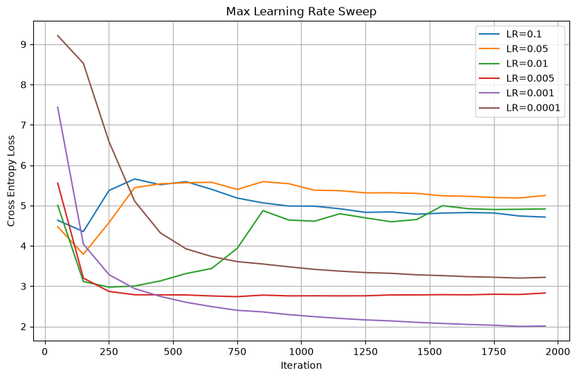
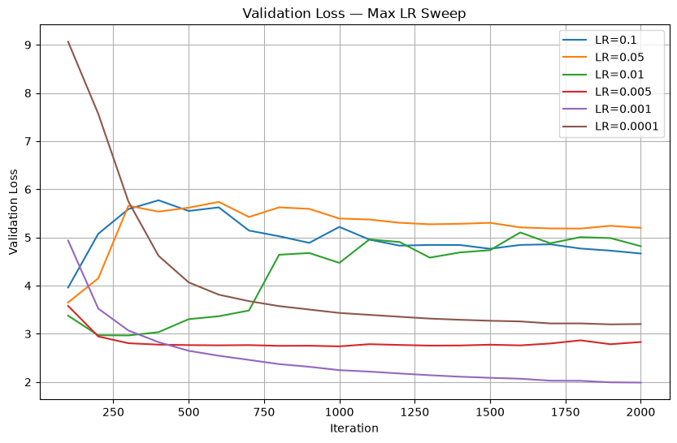
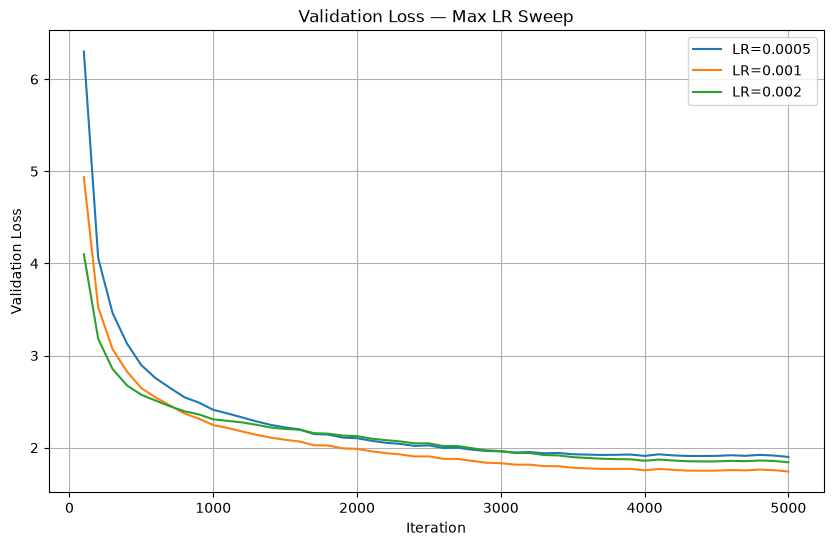

# Experiment 2 — Max Learning Rate Sweep

## Objective

Find a reasonable maximum learning rate for the current Transformer training setup.

All experiments used the same model configuration, dataset, random seed, optimizer settings, and LR schedule. Only `max_lr` was changed.

## Setup

- Optimizer: AdamW
- Seed: 42
- Warmup iterations: 500
- Minimum LR: `1e-6`
- Cosine cycle: 5000 iterations

---

## 1. Initial Max-LR Sweep

Tested:

`[1e-1, 5e-2, 1e-2, 5e-3, 1e-3, 1e-4]`

The first 2000 iterations showed that large learning rates (`1e-1`, `5e-2`, `1e-2`) resulted in substantially higher training and validation loss.

`1e-3` showed the strongest validation performance among the promising candidates.

### Training Loss

### Validation Loss

Based on this initial sweep, the search range was narrowed around `1e-3`.

---

## 2. Refined Sweep

The second experiment compared:

`[5e-4, 1e-3, 2e-3]`

for the full 5000 iterations.

The three learning rates showed different optimization behavior:

- `2e-3` reduced validation loss faster early in training, but later plateaued at a higher loss.
- `5e-4` trained more conservatively and remained stable, but converged more slowly.
- `1e-3` achieved the lowest validation loss by the end of the 5000-iteration run.

Approximate final validation losses:

| Max LR | Final Validation Loss |
|---:|---:|
| `5e-4` | ~1.899 |
| `1e-3` | ~1.741 |
| `2e-3` | ~1.842 |
---

## Conclusion

For the current model, dataset, batch configuration, AdamW optimizer, and 5000-iteration training budget:

**`max_lr = 1e-3` achieved the lowest validation loss among the tested values.**

It will therefore be used as the baseline learning rate for the next experiment, which will investigate the effect of warmup length.

This result is specific to the current experimental setup. Changes to the dataset, model size, batch size, optimizer, or training budget may require re-evaluating the learning rate.
