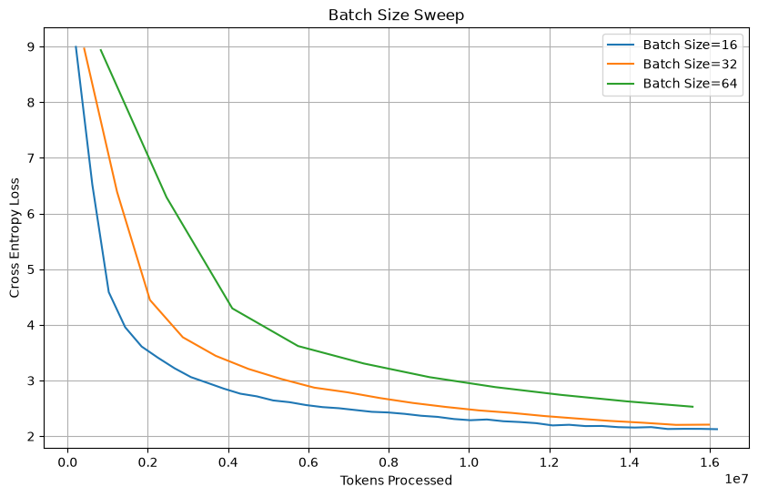
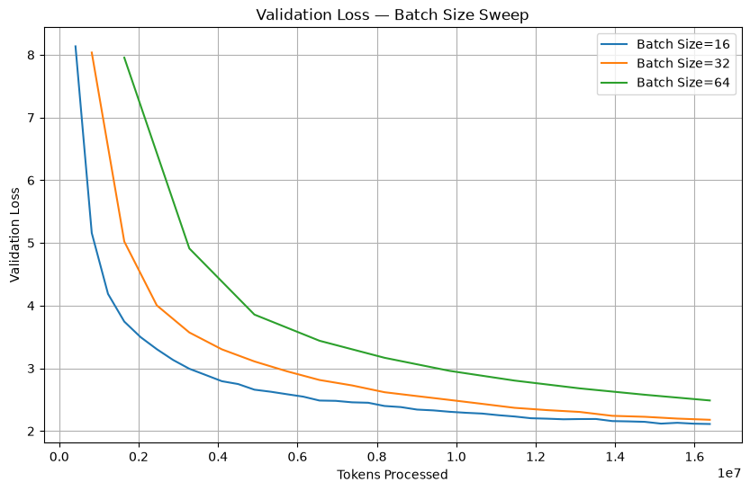
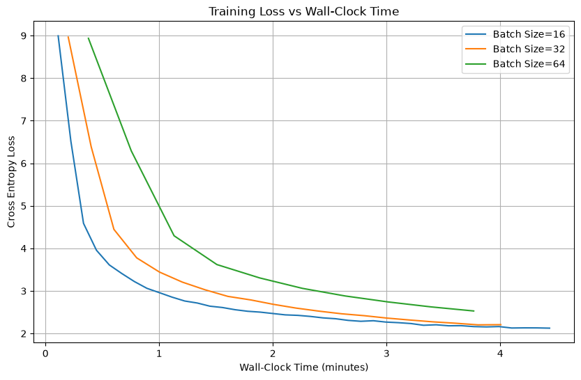

# Experiment 3 — Batch Size Sweep

## Objective

Study the effect of batch size on training efficiency under a fixed token budget.

The experiment compares batch sizes:

`[16, 32, 64]`

The goal is not only to compare final loss, but also to understand the trade-off between:

- optimization / sample efficiency
- number of optimizer updates
- wall-clock training time

## Setup

The following settings were kept fixed across experiments:

- Max learning rate: `1e-3`
- Minimum learning rate: `1e-6`
- Random seed: `42`
- Context length: `256`
- Same total training token budget
- Same model and dataset

Because different batch sizes require different numbers of iterations to process the same number of tokens, the number of training iterations was adjusted accordingly.

The warmup and cosine schedule lengths were also scaled with the total number of iterations so that the LR schedule progressed approximately consistently with the token budget.

---

## 1. Training Loss vs Tokens Processed

When comparing models at approximately the same number of processed tokens, smaller batches achieved lower training loss.

Batch size 16 consistently converged faster with respect to tokens processed, followed by batch size 32 and batch size 64.

This suggests that, under the current configuration, the smaller batch provides better optimization efficiency per training token.

A major reason is that a smaller batch results in more optimizer updates for the same number of processed tokens.

For a fixed token budget:

`smaller batch -> more iterations -> more optimizer updates`

---

## 2. Validation Loss vs Tokens Processed

The validation results show the same overall pattern.

At approximately the same token budget:

- Batch size 16 achieved the lowest validation loss.
- Batch size 32 was slightly worse but relatively close to batch size 16 near the end of training.
- Batch size 64 remained noticeably higher.

Therefore, the lower training loss of batch size 16 also translated into better validation performance rather than only better fitting of the training data.

This indicates that batch size 16 had the best sample efficiency among the tested batch sizes under the current setup.

---

## 3. Training Loss vs Wall-Clock Time

Smaller batches require more optimizer steps to process the same number of tokens.

Therefore, better loss per token does not necessarily mean better practical training efficiency. A smaller batch could potentially require significantly more wall-clock time.

However, in this experiment, the total runtime difference between batch sizes 16, 32, and 64 was relatively small.

Batch size 16 required more optimizer updates but still achieved lower training loss throughout much of the wall-clock comparison.

The larger batches reduced the number of optimizer steps, but the resulting runtime improvement was not large enough to compensate for their lower optimization efficiency in this experiment.

---

## Conclusion

Under the current model, hardware, learning rate, and fixed token budget, **batch size 16 provides the strongest overall result among the tested values**.

The experiment shows an important trade-off when selecting batch size:

`smaller batch -> more optimizer updates -> potentially better loss per token`

but also:

`smaller batch -> more iterations -> potentially longer training time`

In this experiment, batch size 16 achieved lower training and validation loss while requiring only moderately more wall-clock time. Therefore, `batch_size = 16` will be used as the baseline for subsequent experiments.

If the smaller batch had required substantially more wall-clock time while providing only a small improvement in validation loss, batch size 32 could have been a better engineering trade-off.

The result should not be interpreted as batch size 16 being universally optimal. The preferred batch size can change with model size, hardware utilization, learning rate, context length, and total training budget.